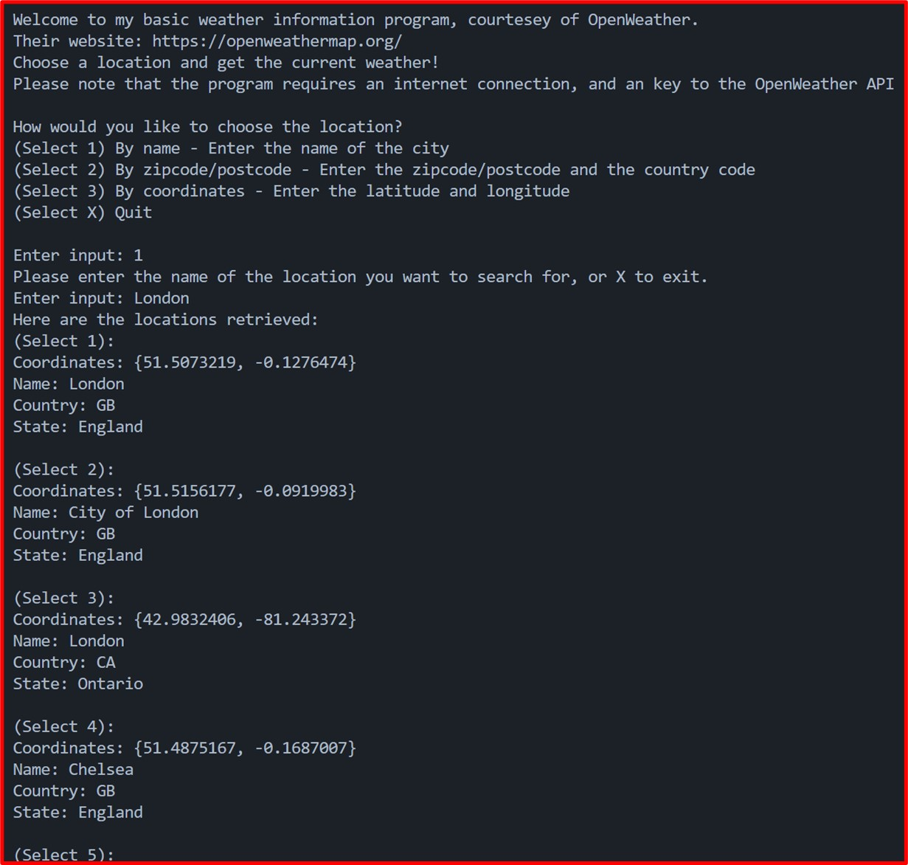
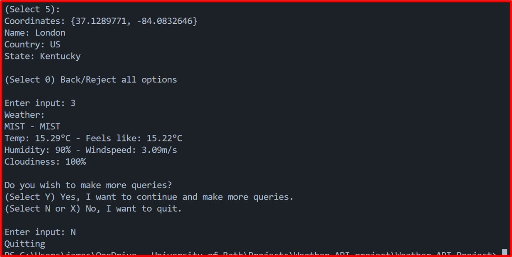
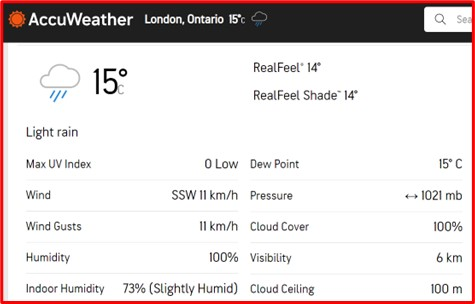
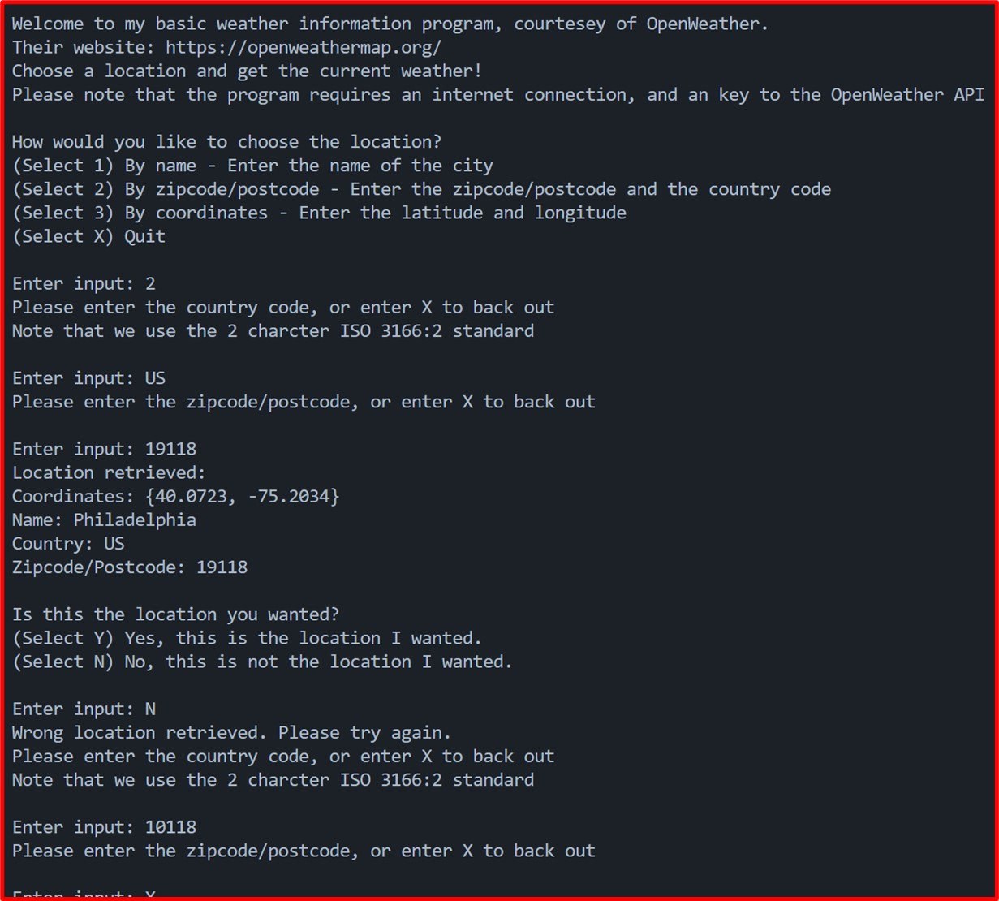
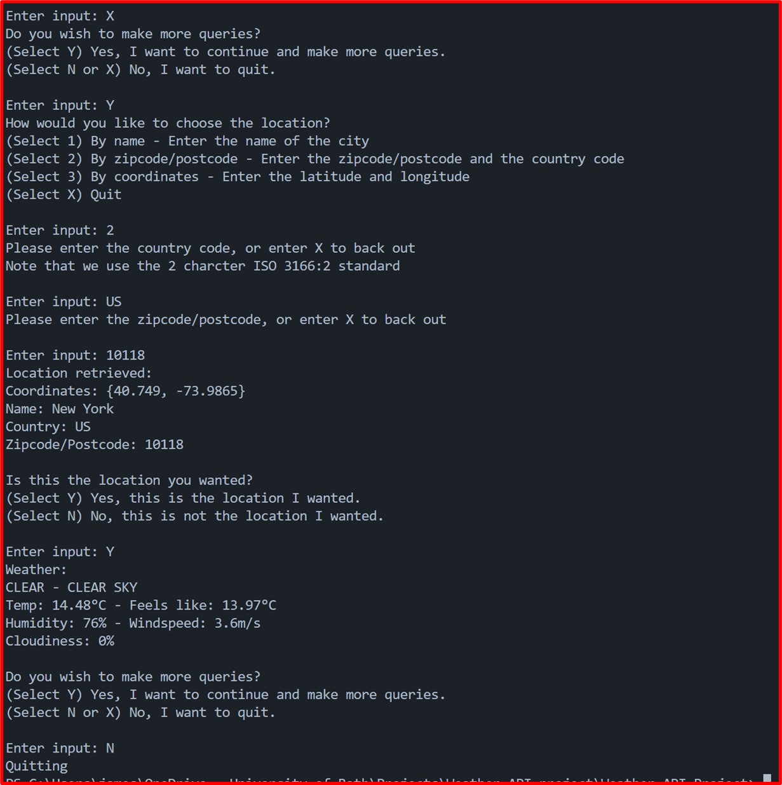
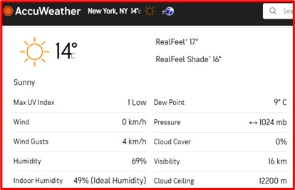
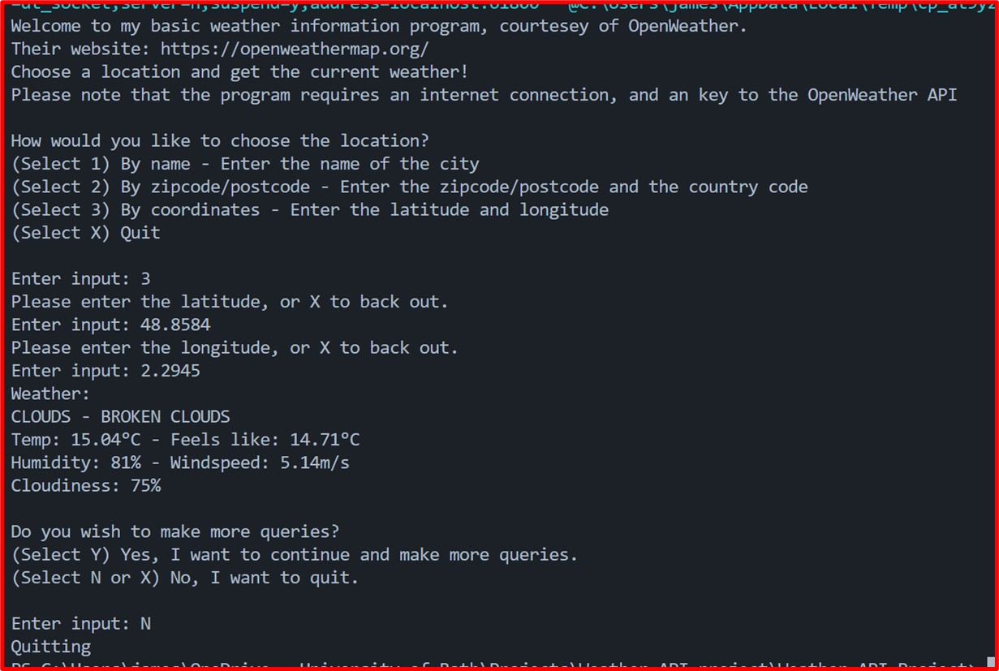
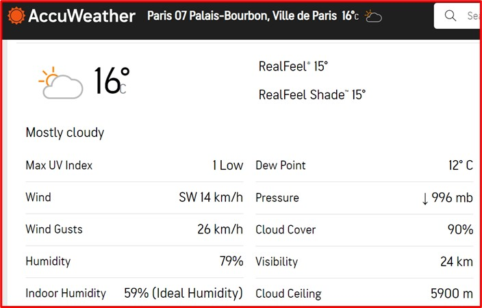

# Weather-API-Project-Demonstration-Documentation

# Demonstration 1

## Description

I tested the select location by name feature by querying the weather in London, Ontario. I entered the name “London” and chose the correct option from the list of locations presented, and got the weather in London, Ontario. The weather data returned was similar to those I found on AccuWeather for New York.

## Screen shots

# Demonstration 2

## Description

I tested the select location by zip code feature, querying about the weather at the Empire Sate building, which has a zip code of 10118, and is in the USA, which has an ISO 31666:2 country code of “US”.  
"Unfortunately", I “accidently” put in the wrong zip code (19118 instead of 10118), and got the wrong location. I entered N to indicate I had the wrong location, but then actually accidently entered the zip code when I was asked for the country code. The program could be improved by making it more obvious at a glance what it is asking for.  
Unfortunately, since the program currently lacks the option to choose to re-enter the country code when entering the zip code, I had to back out entirely, and re-select the option to select location by zip code. I then entered the data correctly, and got weather data that was similar to those I found on AccuWeather for the location. 

## Screen shots

# Demonstration 3

## Description

I tested the select location by coordinates feature, querying about the weather at the Eiffel Tower, which has coordinates of {48.8584, 2.2945}.  
I entered the coordinates and got the selection, and got weather data that was similar to those I found on AccuWeather for Paris 07 Palais-Bourbon, Ville de Paris, which was the closest location that I could find weather data on with AccuWeather.  
However, I would have appreciated it if the program would have also provided some location data to make sure I had the right coordinates.

## Screen shots

# Demonstration 4

## Description

I tested what happens when no key has been inserted into the APIKeyManager.

## Screen shots
